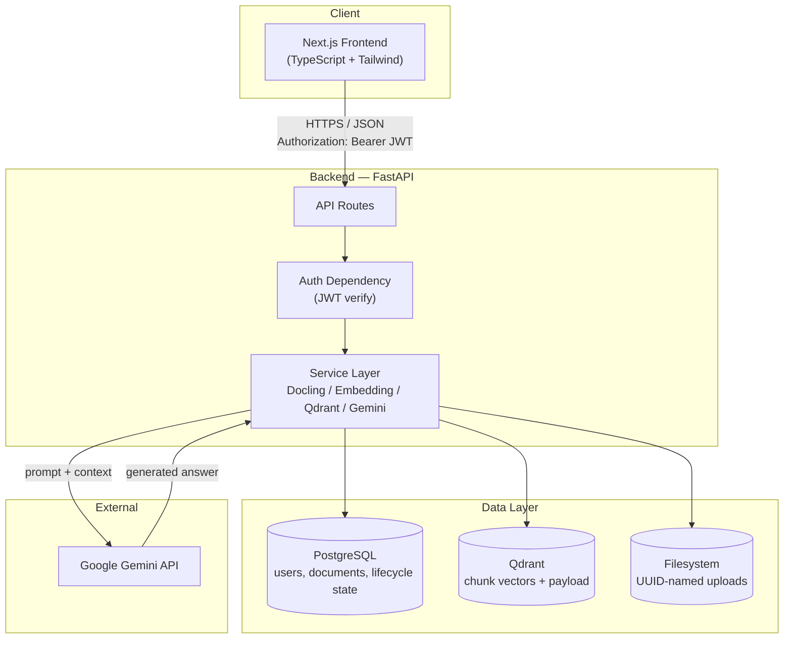
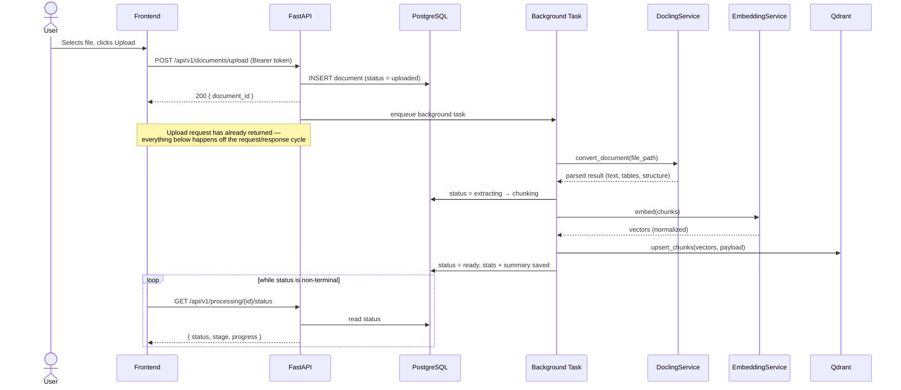
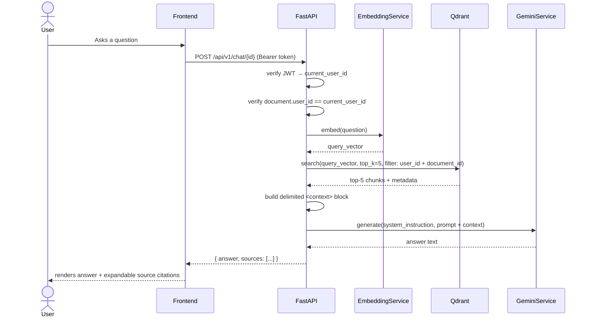
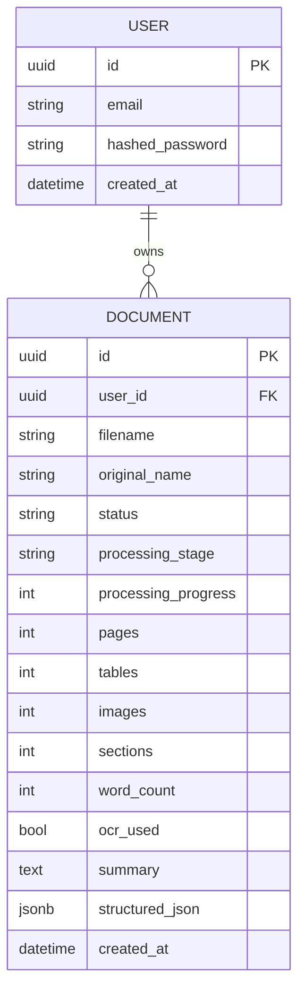

# DocuMind — Architecture

Companion to `documind-master-v3.md`. That document specifies *what* to build; this one explains *how the pieces fit together, why they're shaped this way, and where the seams are for future growth*.

---

## 1. Overview

DocuMind is a document-upload → parse → index → converse pipeline sitting on four moving parts: a Next.js frontend, a FastAPI backend that owns all business logic, PostgreSQL for relational/lifecycle state, and Qdrant for vector search — with Google Gemini as the only externally-hosted dependency. The backend is intentionally the single point of contact for every other system; the frontend never talks to Postgres, Qdrant, or Gemini directly.

---

## 2. High-Level Architecture



The backend is the only component with credentials to Postgres, Qdrant, or Gemini. Nothing external ever holds those secrets.

---

## 3. Component Responsibilities

| Component | Owns | Never does |
|---|---|---|
| Frontend (Next.js) | Rendering, client-side routing, optimistic UI where safe, token attachment to requests | Direct DB/Qdrant/Gemini access, business logic, ownership checks |
| API routes (FastAPI) | Request validation, auth enforcement, response shaping, delegating to services | Talking to Docling/Qdrant/Gemini SDKs directly — always through a service |
| Service layer | All third-party SDK integration (Docling, Gemini, Qdrant, embeddings), isolating API churn | Owning HTTP concerns (status codes, request parsing) |
| PostgreSQL | Users, document metadata, processing lifecycle state, AI summaries | Storing vectors or raw file bytes |
| Qdrant | Chunk vectors + retrieval payload (page, section, element type) | Being the source of truth for document metadata — it's a derived index, rebuildable from Postgres + the original file |
| Filesystem (→ object storage later) | Raw uploaded files, addressed only by UUID | Serving files directly to the client — always proxied through an ownership-checked endpoint |
| Gemini | Text generation only, called with an explicit, delimited context block | Anything treated as a trusted instruction source beyond the system prompt DocuMind itself constructs |

---

## 4. Data Flow: Document Ingestion



The upload response and the processing pipeline are fully decoupled — the frontend never waits on Docling, embeddings, or Gemini to get a `document_id` back.

---

## 5. Data Flow: RAG Chat Query



Two checks happen before a single vector search runs: the JWT is verified, and the *document* is confirmed to belong to that user. A valid token for user A never returns results scoped to user B's documents, even if A guesses B's document ID.

---

## 6. Data Model



Qdrant is not shown in the ER diagram because it isn't relational — treat each vector's payload (`document_id`, `user_id`, `page_number`, `section_title`, `chunk_index`, `element_type`) as a denormalized, rebuildable projection of the document, not a second source of truth.

---

## 7. Why Three Stores, Not One

| Store | Reason it's separate |
|---|---|
| PostgreSQL | Needs transactional guarantees for lifecycle state (a document is never half-updated) and relational integrity (ownership via foreign key) |
| Qdrant | Needs approximate-nearest-neighbor search at a speed and scale Postgres alone (even with `pgvector`) is a reasonable but different trade-off for — Qdrant is the specialized tool here, chosen for retrieval quality and filtering ergonomics |
| Filesystem | Raw bytes don't belong in either database; a document's file is replaceable/reprocessable and shouldn't bloat a relational or vector store |

If a document is deleted, all three must be cleaned up together (file, Postgres row, Qdrant vectors) — see [Resilience](#9-resilience--failure-handling) for what happens when one of those three deletes fails partway through.

---

## 8. Deployment Architecture

**Current (V1) — single host, Docker Compose:**

```
┌─────────────────────────────────────────────────────┐
│                   Docker host                        │
│                                                       │
│  ┌──────────┐  ┌──────────┐  ┌──────────┐  ┌───────┐ │
│  │ frontend │  │ backend  │  │ postgres │  │qdrant │ │
│  │ :3000    │  │ :8000    │  │ :5432    │  │:6333  │ │
│  └──────────┘  └──────────┘  └──────────┘  └───────┘ │
│         (all services on one Docker network)         │
└─────────────────────────────────────────────────────┘
```

This is intentionally simple and correct for portfolio/demo scale. It has two known constraints, tracked in `ROADMAP.md`:
- The backend is **stateful** with respect to the local filesystem (`documents/`) — running more than one backend replica would split uploaded files across hosts. Moving to S3-compatible object storage removes this constraint and is the natural first step toward horizontal scaling.
- Postgres and Qdrant are single-instance with local volumes — fine for a demo, not for anything with a real uptime requirement.

**Future path (not required for V1):** managed Postgres (e.g. RDS/Cloud SQL) + managed Qdrant Cloud + the backend running as a stateless, horizontally-scaled service behind a load balancer (once file storage is externalized) + the frontend deployed independently (e.g. Vercel or a Node server). None of this changes the API contract — it's an infrastructure change, not an application one.

---

## 9. Resilience & Failure Handling

| Failure | Behavior |
|---|---|
| Gemini API times out or rate-limits | Retry with exponential backoff (2–3 attempts, transient errors only); on exhaustion, return a clear "temporarily unavailable" message — never fabricate an answer, never hang the request indefinitely |
| Qdrant unreachable during chat | Surface a clear error; do not fall back to un-grounded generation |
| Qdrant unreachable during ingestion | Processing fails at the `indexing` stage, `status = failed`, error stored — retryable by re-triggering processing, not by re-uploading |
| Docling fails on a corrupt/unsupported file | Fails fast at `processing` stage with a specific error message; temporary files are cleaned up, not left orphaned |
| Backend crashes or worker is lost during processing | PostgreSQL keeps the job claim and lease; Celery late-acks the queue message; the Beat reconciler expires stale claims, applies the attempt budget, and republishes eligible jobs. Fencing tokens prevent an expired worker from overwriting a later attempt. |
| Partial delete (file removed, Qdrant vectors not yet removed) | Delete order should be: Qdrant vectors → file → Postgres row, so a failure leaves an orphaned Postgres row (safe, visible, retryable) rather than a Postgres row pointing at nothing (silently broken) |

---

## 10. Scalability & Evolution Path

Two migrations are pre-planned in the master prompt; here's the reasoning for *when* to make each:

**Queue deployment.** The repository includes an in-process adapter for local development and a Celery/Redis adapter for Compose and deployment. PostgreSQL remains authoritative; Redis carries delivery messages. The scheduled reconciler retries missed dispatches and recovers expired leases. Use late acknowledgement, bounded attempts, and low worker concurrency for parser workloads. Validate broker durability and memory limits in the target environment before adding replicas.

**Per-document Qdrant collections → one shared collection with metadata filtering.** Per-document collections are simple to reason about early on, but collection count becomes an operational cost (index overhead per collection, slower cross-document operations) as users accumulate documents. Migrate once a single user's document count makes per-document collections unwieldy, or once cross-document search (see `ROADMAP.md` V2.0) is on the near-term roadmap — a shared collection with a `document_id` filter is a prerequisite for querying across documents at all.

---

## 11. Security Architecture

**Identity boundary:** register/login issue a JWT; every subsequent request carries it as `Authorization: Bearer <token>`; a FastAPI dependency verifies the signature and expiry and yields `current_user_id`. No endpoint accepts a client-asserted user ID from anywhere else.

**Data isolation boundary:** every row in `documents` carries `user_id`; every Qdrant payload carries `user_id`; every query — list, get, delete, chat — filters on it, derived only from the verified token, never from the request body or URL.

**Secrets boundary:** API keys and the JWT signing secret live only in environment variables, are never logged, never returned in an API response, and never committed (`.env` is gitignored). Rotating `JWT_SECRET_KEY` invalidates all existing sessions — acceptable and expected behavior, not a bug to work around.

**Network boundary:** CORS is an explicit allowlist (`CORS_ORIGINS`), never `*`. Inter-service traffic (backend ↔ Postgres ↔ Qdrant) stays on the Docker-internal network and is never exposed to the host beyond what's declared in `docker-compose.yml`.

---

## 12. Architecture Decision Records

| Decision | Why | Alternative considered | Trade-off accepted |
|---|---|---|---|
| Docling for parsing | Layout-aware extraction (tables, sections, OCR) in one library | `Unstructured.io`, raw `PyMuPDF` | Newer/smaller ecosystem — mitigated by the service-abstraction rule, so swapping later touches one file |
| Qdrant for vectors | Purpose-built ANN search, strong filtering support, easy self-host via Docker | `pgvector` (one less moving part), Pinecone/Weaviate (managed) | An extra service to run/operate vs. `pgvector`'s simplicity; chosen for retrieval quality and filtering ergonomics at the cost of one more container |
| Gemini for generation | Configurable via env, strong long-context support for document-heavy prompts | OpenAI, Anthropic, a self-hosted model | Vendor dependency for the core value proposition — isolated behind `GeminiService` so the model/provider is swappable without touching callers |
| In-process queue adapter in development | Zero extra infrastructure for unit/local API work | Celery + Redis in Compose/deployment | Dev mode does not survive API process loss; deployments select the durable adapter and validate recovery |
| Per-document Qdrant collections before a shared one | Simpler mental model, no cross-tenant filter to get wrong early | Shared collection with `user_id`/`document_id` filtering from day one | Collection sprawl at scale — accepted because it defers a real complexity cost until cross-document features (ROADMAP V2.0) actually need it |
| JWT (access + refresh) over session cookies alone | Works cleanly for a decoupled frontend/backend without shared-domain cookie complexity | Server-side sessions | Access token exposure risk if mishandled — mitigated by keeping it in memory, not `localStorage`, and keeping it short-lived |

---

## 13. Non-Functional Requirements

See `documind-master-v3.md` → **Non-Functional Requirements** for the concrete performance/availability targets this architecture is designed to meet. None of the decisions above should be revisited without checking whether they still hold.
