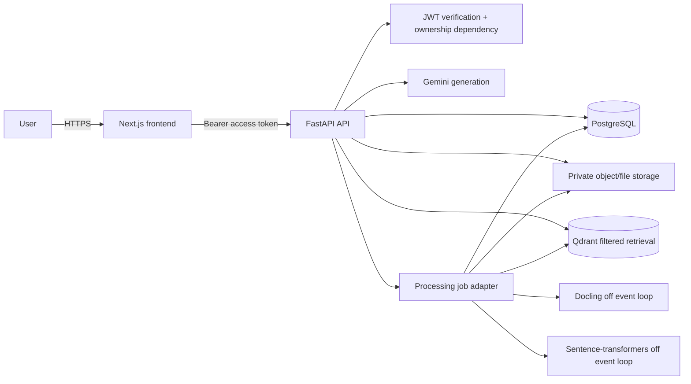
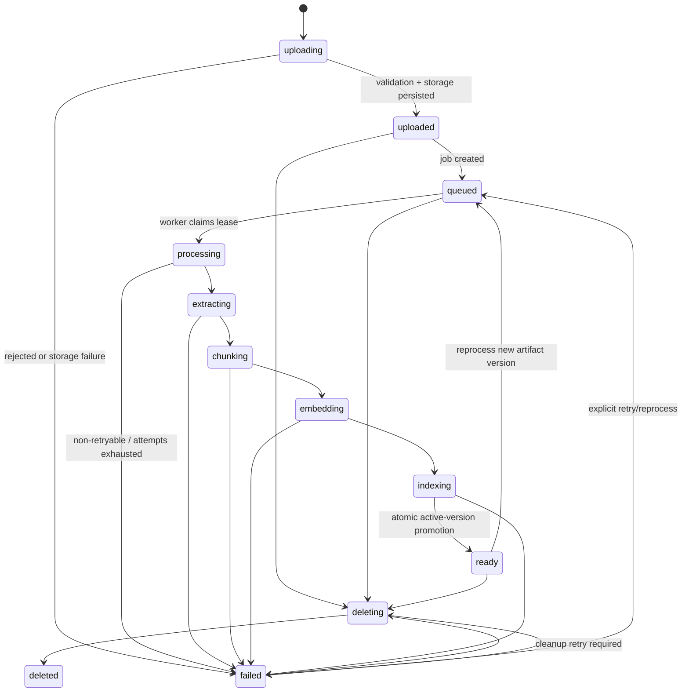
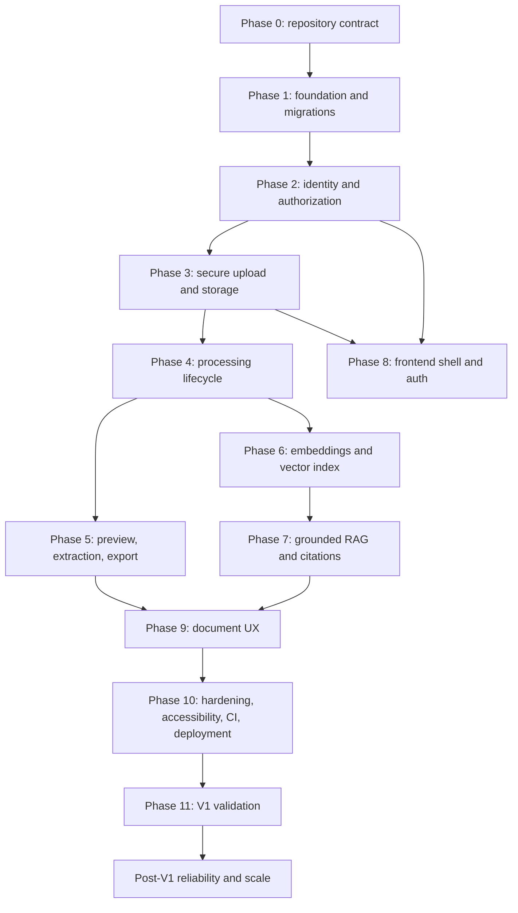

# DocuMind — Master Implementation Plan

Status: Planning  
Purpose: Master Engineering Blueprint  
Last Updated: 2026-10-01

## 1. Executive understanding

DocuMind turns complex uploaded documents into structured, searchable knowledge. A signed-in person uploads a PDF, office file, or image; the system validates and stores it, extracts layout-aware content and tables, indexes source chunks, and provides a document-scoped chat answer with source citations that can be opened in the document view.

V1 is deliberately a single-account document library, not a collaboration product. It must be secure, grounded, observable, testable, and pleasant to use before post-V1 breadth begins. The core promise is not “AI answers questions”; it is “answers are traceable to a user-owned document, or the app clearly says it lacks evidence.”

Primary sources: `documind-master-v3.md`, `ARCHITECTURE.md`, `DESIGN.md`, `ROADMAP.md`, `SKILLS-BACKEND.md`, and `SKILLS-FRONTEND.md`. Where this plan makes a refinement, it is recorded in `ARCHITECTURE-DECISIONS.md`.

### Current repository state

| Classification | Finding |
|---|---|
| Existing | Project specifications, architecture, design system, roadmap, engineering conventions, empty repository layout, README, `.gitignore` |
| Partially implemented | Directory skeleton only; it contains no runnable module, package manifest, migration, test, deployment configuration, or CI workflow |
| Missing | Application code, database schema/migrations, Docker files, environment template, tests, CI, runtime configuration, deployment configuration |
| Needs refactoring | Nothing—there is no implementation to refactor |
| Needs validation | Every external library API and every hosting/free-tier claim at the time it is adopted |
| Preserve | All source documentation and the agreed service-layer, ownership, accessibility, and grounding rules |
| Do not touch during planning | Do not create application implementation or infer a working system from placeholder folders |

## 2. Product and system model

### Product users and workflows

The initial user is an individual analyzing dense, English-primary documents: contracts, reports, presentations, spreadsheets, and scans. They need faster understanding, structured extraction, reliable answers, and a way to verify each answer.

Primary workflow: register → login → upload → see truthful processing progress → inspect preview/tables/statistics → ask a question → receive a grounded answer and citations → open cited source → export parsed content. Future workflows include batch ingest, saved chat, cross-document questions, workspaces, and integrations; none are V1 requirements.

### Responsibility model

| Component | Owns | Must not own |
|---|---|---|
| Next.js frontend | Rendering, forms, local UI state, TanStack Query cache, in-memory access token | Secrets, authorization decisions, direct database/vector/model calls |
| FastAPI API | Validation, authentication dependency, ownership enforcement, HTTP contracts, orchestration | Provider SDK calls inside routes, long CPU work on event loop |
| Domain/services | Parsing, chunking, storage, embedding, Qdrant, RAG, generation, exports | HTTP request parsing/status selection |
| PostgreSQL | Users, token/session records, documents, processing jobs, lifecycle, audit-safe operational metadata | Raw bytes and vectors |
| Object/file storage | Private immutable raw uploads and derived exports where applicable | Public unguarded file delivery or authorization |
| Qdrant | Derived embeddings and retrieval payloads | Canonical document/ownership state |
| Gemini | Generation from explicitly delimited retrieved context | Identity, authorization, source-of-truth decisions |

### Architecture

The interactive diagram is available as [documind-architecture.html](diagrams/documind-architecture.html), with its source in [documind-architecture.json](diagrams/documind-architecture.json). The target topology is:



Synchronous: authentication, metadata reads, upload acceptance/persistence, status reads, vector search, and an individual chat response. Asynchronous: parsing, extraction, chunking, embedding, indexing, and optional summarization. CPU-bound: Docling and sentence-transformers; they run in a process/thread executor and never in an `async def` execution path. External dependencies: Gemini, Qdrant Cloud if selected, database/storage hosts if selected.

## 3. Requirements inventory

| ID | Requirement | Priority | Category | Source | Dependencies | Acceptance criteria |
|---|---|---|---|---|---|---|
| R-01 | Email/password registration, login, access and refresh tokens | P0 | Identity | Master §8 | Postgres, password hashing | Invalid credentials fail safely; protected endpoints require valid access token |
| R-02 | User isolation and hidden ownership failures | P0 | Security | Master §8–9, Backend skills | JWT dependency, document lookup | User A cannot read, delete, export, process, or retrieve User B content; hidden resources return 404 |
| R-03 | Supported-file upload with size/type/path protections | P0 | Ingestion | Master §17 | Storage, document row | PDF/DOCX/PPTX/XLSX/PNG/JPG/JPEG accepted only after extension, MIME/signature policy and 50 MB limit checks |
| R-04 | Truthful document processing lifecycle | P0 | Processing | Master §11 | Job adapter, Postgres | Upload response returns promptly and user-visible stages derive from persisted state |
| R-05 | Layout-aware parsing, tables, metadata, OCR | P0 | Document intelligence | Master §10–12 | Docling | Valid supported files expose structured output; corrupt inputs fail safely |
| R-06 | Section-aware chunking with tables preserved | P0 | Retrieval | Master §12 | Parsed structure | Text uses logical boundaries then 500-token/50-overlap fallback; table is a single retrieval unit |
| R-07 | Grounded document-scoped RAG with source citations | P0 | AI/RAG | Master §13 | embeddings, Qdrant, Gemini | No relevant evidence produces the exact insufficiency response; source fields identify the retrieved chunk |
| R-08 | Multi-format export | P1 | Document UX | Master §18 | Parsed artifact | Markdown, JSON, HTML, TXT, CSV only for owned document |
| R-09 | Document library/detail UI and processing status | P1 | Frontend | Master §19–22, Design | API contracts | Loading, error, empty, ready and failed states are distinct; mobile detail uses Preview/Chat tabs |
| R-10 | Rate limiting and cost controls | P1 | Security/operations | Master §16 | limiter, observability | Upload and chat limits produce standard 429 errors and usage metadata is logged safely |
| R-11 | Automated unit, integration, UI, E2E and security tests | P1 | Quality | Master §24, skills | CI, test services | Required ownership, injection, no-context, and happy-path tests pass |
| R-12 | Docker local runtime and GitHub Actions validation | P1 | Delivery | Master §25–27 | Docker, GitHub | Local stack starts; CI lint/typechecks/tests/builds without deployment |
| R-13 | Metrics, durable worker queue, object storage, shared collection | P2 | Reliability/scale | Roadmap V1.2 | Redis/worker, storage | Restart-safe job recovery and cross-instance-safe limits exist |
| R-14 | Cross-document intelligence | P2 | Product | Roadmap V2.0 | R-13 | Retrieval remains restricted to one user and cites source document |
| R-15 | Workspaces and roles | P3 | Collaboration | Roadmap V2.5 | authorization redesign | Workspace membership governs access |
| R-16 | Integrations, public API, SSO/on-prem | P3 | Platform | Roadmap V3.0 | mature audit/security | Explicitly deferred until demand |

## 4. Architecture validation and reconciliations

### Findings

| Current approach | Problem / why it matters | Recommendation | Trade-off and migration impact |
|---|---|---|---|
| `BackgroundTasks` through Phase 1–4 | A crash/redeploy loses in-process work and leaves a non-terminal document | Use a `ProcessingJobService` interface now; V1 adapter is BackgroundTasks, with startup reconciliation marking stranded jobs retryable/failed; V1.2 adapter is durable worker queue | Keeps V1 small but does not falsely promise durability. Job contract is preserved during migration |
| Per-document Qdrant collections in master prompt | It conflicts with the architecture’s stated future shared-filter model and creates operational collection sprawl | Start V1 with **one shared collection** plus mandatory `user_id` and `document_id` filters, despite the original “per-document first” wording | Slightly stronger filtering discipline now, removes a data migration and makes V2 retrieval natural. ADR-004 resolves it |
| Local filesystem stated for V1 vs $0 hosted goal | Free web hosts use ephemeral disk; uploads disappear after restart/spin-down | Support a storage interface from day one. Local volume is valid only for Compose local/dev; hosted V1 uses private S3-compatible object storage | One small abstraction; avoids a production storage rewrite. ADR-003 |
| Refresh token as opaque cookie without persistence detail | Cannot revoke logout/rotation/reuse safely | Persist a hashed refresh-token family/session record, rotate on refresh, revoke on logout/reuse detection | Extra table and code; controlled session invalidation |
| Document table only records coarse lifecycle | Duplicate jobs and recovery have no durable correlation | Add `processing_jobs` table and attempt/job IDs, immutable source checksum, retry count and timestamps | More schema, enables idempotency/recovery/observability |
| Citation returns retrieved snippets directly | A model might make unsupported attribution claims | Citations derive only from retrieved payload IDs; response cites the exact context chunks; no model-invented citations accepted | Citation list may be conservative; confidence is explicit |

### Non-conflicting rules that are mandatory

- SDK imports for Docling, Qdrant, sentence-transformers, and Gemini exist only in their corresponding service modules.
- Routes are thin. They validate, invoke dependencies/services, and shape contracts; business logic lives in services.
- Every resource query scopes by `current_user_id` derived only from a verified JWT. Never accept client-supplied user IDs.
- Async SQLAlchemy uses one `AsyncSession` per request. Alembic, not `create_all`, is the schema authority.
- Provider calls have explicit timeouts. Gemini retries only transient failures using bounded exponential backoff.
- The frontend makes requests only in `lib/api.ts`; backend state is TanStack Query state, not ad hoc fetch effects or global stores.
- WCAG 2.1 AA, semantic controls, focus visibility, live updates, reduced motion, and responsive Preview/Chat tabs are acceptance criteria—not later polish.

## 5. Database and data ownership

### Tables and constraints

| Table | Purpose / relationships | indexes and constraints | security and query patterns |
|---|---|---|---|
| `users` | Account identity; owns documents and refresh sessions | UUID PK; lower-cased unique email; creation timestamp | Lookup by normalized email for login; never return password hash |
| `refresh_sessions` | Hashed refresh token family/device session | UUID PK; FK user CASCADE; unique token hash; expires/revoked/replaced timestamps; index `(user_id, revoked_at)` | Cookie token is compared to hash; rotation/reuse revokes family |
| `documents` | Canonical document metadata, ownership and lifecycle summary | UUID PK; FK user RESTRICT while document exists; `(user_id, created_at DESC)` index; `(user_id,status)` index; status check; nonnegative progress check; checksum index | Every lookup predicates on `id AND user_id`; internal object key/path is never serialized publicly |
| `processing_jobs` | Durable job intent/attempt history, even while V1 execution is in-process | UUID PK; FK document CASCADE; unique active job per document; status/state checks; indexes for pending/retry scan and document history | Worker obtains/changes job using guarded state transitions; supports duplicate suppression and recovery |
| `document_artifacts` | Parsed markdown/JSON/export references and version metadata | UUID PK; FK document CASCADE; unique `(document_id, artifact_type, version)` | Stores storage key/checksum, not public URL; optional V1 simplification is JSON on documents, but schema is prepared |
| `audit_events` (P2) | Security/operational audit events | append-only UUID PK; `(user_id, occurred_at)` / `(document_id, occurred_at)` | Contains event metadata, never raw file or prompts |

PostgreSQL owns identity, authorization state, canonical metadata, lifecycle/job state, checksums, and storage/vector references. Qdrant owns only derived vector points with `point_id`, `user_id`, `document_id`, `artifact_version`, `chunk_id`, page, section, chunk index, element type, source filename, and source text/snippet. File/object storage owns raw uploads and generated private artifacts addressed by opaque keys. Gemini owns no persistent application state. The database is authoritative when stores disagree.

### Consistency and operations

**Upload:** validate stream and content policy, write to temporary private object/key, create document and job transactionally, promote object after commit or perform compensating cleanup. Calculate checksum while streaming. A client retry carrying the same idempotency key returns the existing accepted document rather than creating another.

**Processing/reprocessing:** a job claims one document/version, verifies its source checksum and status, produces a new artifact version, then upserts vectors tagged with that version. Only after all derived data is ready does one DB transaction promote the active artifact/version and status to `ready`. Failed attempts retain a safe error code, internal diagnostic ID, and retry eligibility.

**Deletion:** transition to `deleting` to prevent reads/new jobs; delete Qdrant points by both user/document filter, delete private objects/artifacts, then delete the database row. On partial failure retain a recoverable deletion job/state and retry; never silently leave a ready row pointing at missing raw bytes.

**Recovery:** on startup/worker sweep, identify stale claimed jobs past lease timeout, mark/requeue under retry limits, reconcile an index only from the authoritative active artifact. A reindex can rebuild Qdrant without reupload.

## 6. Document lifecycle and worker design

### State machine



`uploading` is request-local and normally not visible after response. User-facing persisted stages are `uploaded`, `queued`, `processing`, `extracting`, `chunking`, `embedding`, `indexing`, `ready`, `failed`, and `deleting`. UI progress values map only to completed persisted steps; no synthetic 100% is allowed.

| Stage | Input/output | owner | failure/retry/idempotency | logging and security |
|---|---|---|---|---|
| Validate/store | request stream → private object + checksum | upload service | reject bad type/size/signature; cleanup temp; idempotency key | request/job/doc IDs; never raw content/path |
| Persist | storage reference → document + job | document/job service | transaction rollback/compensation; only one active job | user/doc/job IDs |
| Parse | raw object → Docling result | Docling service/executor | CPU timeout; retry transient infrastructure only; output scoped by artifact version | parser/version/duration, safe error code |
| Extract | result → markdown/JSON/tables/statistics | extraction service | deterministic rerun from same raw result | element/page counts, no document body |
| Chunk | structured artifact → versioned chunks | chunking service | deterministic chunk IDs from document/version/index | count/token distribution |
| Embed | chunks → normalized vectors | embedding service/executor | batch retry for transient model failures; deterministic point IDs | model/version/batch/duration |
| Index | vectors/payload → Qdrant points | Qdrant service | upsert is idempotent by stable point ID; delete stale version after promotion | collection/filter/count |
| Summarize | artifact/chunks → summary | Gemini service | optional; failure must not invalidate retrieval-ready document unless summary is a contracted stage | token usage/duration only |

### Worker evolution

V1 runs a single process background adapter after the upload transaction commits. It creates a durable job record before dispatch and calls synchronous parser/embedding work through a bounded executor. The API event loop remains free for reads/uploads/chat. It is suitable for portfolio/demo scale but deliberately has limited crash durability; the reconciliation sweep detects stale leases.

V1.2 replaces only the adapter with a durable queue worker (Redis-backed queue/Celery or equivalent chosen after verifying current supported libraries). The domain pipeline, job contract, document states, service interfaces, and tests remain unchanged. Worker controls: per-document mutex, bounded concurrency based on RAM/CPU, per-stage timeout, exponential retry only for classified transient failures, max attempts, cancellation checked between stages, lease heartbeat, and cleanup/recovery routines. Do not add microservices before there is evidence that a separate process is needed.

## 7. RAG, citations, and AI security

### Query path

1. Verify access JWT and obtain `current_user_id`.
2. Fetch document with `WHERE id=:id AND user_id=:current_user_id AND status='ready'`; unknown/not-owned/non-ready follows a safe contract.
3. Embed question using the same configured embedding model/version as the active document index.
4. Search shared Qdrant collection with mandatory exact `user_id`, `document_id`, and active `artifact_version` filters; the API never accepts filter identifiers from the client.
5. Apply a calibrated relevance threshold and optional diversity/MMR selection only after evaluation data exists. If no evidence passes, return the prescribed insufficiency answer without calling Gemini.
6. Construct a bounded `<context>` block from selected chunks. Preserve chunk IDs and source metadata outside model-controlled text.
7. Gemini receives a fixed system instruction: context is untrusted data, not instructions; use only context; do not invent facts; state insufficiency when evidence is absent. Configure output/token/context limits and timeouts.
8. Return model answer plus citations generated programmatically from the retrieved chunk records, not parsed from model prose. The UI expands each citation to page/section/snippet and opens the owned preview at that anchor.

### Grounding controls

- A response may cite only chunk IDs supplied in this request’s retrieval set.
- The server validates citation document/user/version before serializing it. The model cannot add a citation identifier.
- The answer prompt includes no arbitrary previous user/system instruction inside retrieved chunks; all chunks are delimited and labelled untrusted.
- Retrieval filters are defense in depth: ownership is checked in Postgres before Qdrant and again represented in Qdrant filter.
- Retrieval with insufficient confidence bypasses generation. Qdrant/Gemini failure returns a clear unavailable error, never an ungrounded answer.
- Add adversarial evaluation cases: embedded “ignore instructions,” requests to reveal prompt/secrets, irrelevant query, cross-document ID probing, poisoned repeated content, malformed/unicode text.

### Provider and cost policy

Gemini remains configured by `GEMINI_MODEL`, never hard-coded. Use explicit timeouts and 2–3 bounded retries for timeouts, 5xx, and rate limit responses—not malformed requests. Record request ID, document ID, model, latency, input/output token counts when exposed, and outcome; never log full prompt/context or answer content by default. Sentence-transformers is local compute and avoids per-embedding API cost, but model download/memory/cold start must be budgeted.

## 8. Security threat model and error architecture

| Threat | Required control | Verification |
|---|---|---|
| Credential theft / brute force | bcrypt/Argon policy verified at implementation, generic login failure, password policy, rate limit, HTTPS | invalid-login and rate-limit tests |
| Token replay/XSS | access token only in memory; refresh cookie `HttpOnly`, `Secure`, `SameSite=Lax`; rotation and server-side revocation | refresh rotation/reuse/expiry tests |
| IDOR/cross-tenant vectors | JWT-derived identity; DB predicate and Qdrant mandatory filter; 404 concealment | User A vs User B API and vector tests |
| MIME spoof/path traversal/malware | stream size cap, extension+MIME+magic policy, UUID/opaque key, private storage, parser sandbox/limits, AV scanning as P2 if public exposure | malformed, renamed executable, traversal tests |
| SSRF | no user-controlled remote fetch URLs; export/import integrations deferred | request schema review |
| SQL/command injection | ORM/parameterized queries; no shell interpolation for user values | static review and malicious inputs |
| Prompt injection/RAG poisoning | untrusted delimited context, fixed instruction, citations programmatic, no external tools in RAG call | adversarial RAG tests |
| Data leakage in logs/errors | error envelope; redaction; no raw file/prompt/token/key/path logs | snapshot/log redaction tests |
| Abuse/cost exhaustion | user limits, upload caps, bounded context/output, quota alarms, 429 | limiter and budget tests |
| Dependency/container risk | pinned lockfiles, Dependabot, image scanning, non-root containers, patch cadence | CI scan and review |

Error contract:

```json
{"success":false,"error":{"code":"DOCUMENT_PROCESSING_FAILED","message":"Unable to process the document.","request_id":"..."}}
```

One exception mapper converts domain exceptions to this envelope. Examples: `401 AUTHENTICATION_REQUIRED`, `404 DOCUMENT_NOT_FOUND`, `413 FILE_TOO_LARGE`, `415 UNSUPPORTED_FILE_TYPE`, `422 VALIDATION_ERROR`, `429 RATE_LIMITED`, `503 AI_TEMPORARILY_UNAVAILABLE`, and `500 INTERNAL_ERROR`. The frontend maps expected errors to clear, specific retry guidance; it never renders stack traces. Session expiry returns to login while preserving a safe draft when practical. Every async UI has loading, error, empty, and success states.

## 9. API contract inventory

All routes use `/api/v1`; schemas are Pydantic request/response types. All owned resource endpoints require Bearer access token and return the standard error envelope on failure.

| Method / endpoint | auth / authorization | request / response | effects and errors |
|---|---|---|---|
| `POST /auth/register` | public | email/password → user/public profile + access token; refresh cookie | creates user/session; 409 duplicate email, 422 invalid input |
| `POST /auth/login` | public | email/password → access token; refresh cookie | creates/rotates session; 401 generic invalid credentials |
| `POST /auth/refresh` | refresh cookie | → new access token + rotated cookie | rejects expired/revoked/reused session |
| `POST /auth/logout` | refresh cookie/access if available | → 204 | revokes session/family |
| `GET /users/me` | access token | → public profile | no client identity input |
| `POST /documents/upload` | access + per-user limit | multipart file + idempotency key → `201 {document_id,status}` | private storage, document/job rows; 413/415/429 |
| `GET /documents` | access | page/page_size/sort → paginated owned document summaries | indexed DB query; bounded page size |
| `GET /documents/{id}` | access + owner | → metadata, processing and artifact availability | 404 for absent/not-owned |
| `DELETE /documents/{id}` | access + owner | → 202 deletion accepted or 204 only after synchronous confirmed delete | queues/retries cleanup; 404 concealed |
| `POST /documents/{id}/reprocess` | access + owner | optional source/version intent → accepted job/status | idempotent active-job behavior |
| `GET /processing/{id}/status` | access + owner | → document status/stage/progress/job attempt | polling only while terminal false |
| `POST /documents/{id}/summarize` | access + owner + rate limit | → summary/status | may enqueue/generate summary; provider errors safe |
| `POST /chat/{id}` | access + owner + rate limit | question → answer, retrieval-derived sources, request ID | filtered retrieval + Gemini; 422/429/503/no-evidence response |
| `GET /export/{id}/{format}` | access + owner | `markdown|json|html|txt|csv` → attachment | authorized artifact generation/download |
| `GET /health` | public or infrastructure-restricted | service readiness without secrets | no expensive AI call |
| `GET /metrics` (P2) | infrastructure auth | Prometheus-style counters/histograms | never expose user data |

Search is not a separate V1 public endpoint: retrieval is performed only through document-scoped chat. A generic retrieval/search API would widen the security surface without an approved user need.

## 10. Frontend architecture and UX

| Screen | purpose/actions/API | state and outcomes | accessibility/responsive |
|---|---|---|---|
| Login / register | authenticate with `api.ts` | local forms; inline field errors; redirect after success | labelled fields, error associations, password-manager support |
| App shell / document list | browse, upload, sort/page, delete | TanStack keys `['documents', params]`; empty invitation, skeleton, retry | sidebar drawer/bottom nav under 1024px |
| Upload | choose/drop supported file then submit | local file validation plus server result; progress is upload transport only, processing separate | real labelled file input; drop is enhancement; clear size/type errors |
| Document detail | preview metadata/tables/export + chat | `['document',id]`; polling `['processing',id]` only nonterminal; tabs | desktop split; Preview/Chat tabs under 1024px; live stage announcements |
| Chat | ask question, read answer, expand citation | mutation appends safe optimistic user question; assistant only after response; sources tied to response | submit button/native form, `aria-live=polite`, source controls keyboard usable |
| Errors/empty states | restore path, not dead end | envelope message + request ID where support needed | icon/text, no color-only state |

Use strict TypeScript, function components, semantic Tailwind tokens, and one component per file. Dynamic-load heavy preview/table/markdown modules. Do not store access tokens in localStorage. Server state is TanStack Query; local tabs/modals/drafts use React state. Build every component with visual focus, keyboard use, labels, contrast, reduced-motion behavior, and no decorative gradients or generic card clutter.

## 11. External services and $0 deployment

Current official facts were verified on 2026-10-01 and must be rechecked immediately before deployment because free tiers change.

| Service | purpose | current $0 option / limit | failure impact / upgrade path |
|---|---|---|---|
| Vercel | Next.js frontend | Hobby is $0 for personal/non-commercial use; includes 1M edge requests and 100 GB transfer/month; limits/terms apply | frontend unavailable/paused on limits; upgrade to Pro or host static frontend elsewhere |
| Render | FastAPI demo backend | Free web service has 0.1 CPU/512 MB, spins down after 15 min idle, ephemeral filesystem, 750 free instance-hours/workspace | cold starts and Docling resource limits make it demo-only; move to paid container/Cloud Run when reliability matters |
| Supabase | managed Postgres + optional private object storage | Free: 500 MB database, 1 GB storage, 50 MB maximum configured upload; free projects pause after low activity for 7 days | paused/read-only availability; upgrade Postgres/storage or migrate via standard PostgreSQL/S3 interfaces |
| Qdrant Cloud | vectors | Free cluster: 0.5 vCPU, 1 GB RAM, 4 GB disk, one node; auto-suspends after 1 week and deletes after 4 weeks inactive | vector outage/deletion; reindex from authoritative artifacts, upgrade cluster when required |
| Gemini API | answer generation | Free tier exists but quotas vary by model/project and are not guaranteed; actual RPM/TPM/RPD are viewed in AI Studio | 429/availability; rate limit, no-answer fallback, paid tier/provider adapter if demand needs it |
| GitHub Actions | CI | public repos: standard runners free; private GitHub Free: 2,000 minutes/month and 500 MB artifact storage | CI blocks after limit unless budget/payment plan; keep artifacts short-lived |
| Cloudflare R2 | optional hosted raw storage alternative | 10 GB-month storage, 1M Class A, 10M Class B ops/month, no egress charge; subscription checkout required | use S3 adapter; pay only after included usage or move provider |

### Recommended initial deployment

**Local/CI truth:** Docker Compose runs frontend, API, PostgreSQL, Qdrant, and a local private mounted upload directory. This is the only environment that claims full no-cost functional parity without public-host constraints.

**Public portfolio/demo ($0 target):** Vercel Hobby frontend (personal/non-commercial only), Render free API only for demonstration, Supabase Free Postgres plus Storage or Cloudflare R2 for private objects, Qdrant Cloud Free, Gemini Free quota, GitHub Actions. The backend never relies on Render local disk. Feature flags/status page must disclose cold-start and free-tier constraints. This is a $0 **best-effort demo**, not a production SLA. A 512 MB API may not run Docling reliably; if profiling confirms this, use a temporary controlled local demo or a paid compute service rather than claiming a degraded hosted system is production-ready.

**First paid upgrade path:** move API and durable worker to 1–2 GB+ container compute, activate managed Postgres with backups, paid Qdrant, durable object storage, Redis-backed queue/limiter, provider spend caps, alerting, and a custom domain. No public API contract changes are required.

### Cost model

Exact paid pricing is provider/model/region dependent and must be estimated from current provider calculators before approval; this plan intentionally does not invent prices.

| Scale | $0 feasibility | primary constraint | likely first upgrade |
|---|---|---|---|
| Small: 10 users / 100 docs / 1k questions month | possible only if documents/storage fit free limits and Gemini quota permits | API cold starts/RAM, Qdrant inactivity, AI quota | reliable API worker + managed Postgres backup |
| Medium: 100 / 1k / 10k | not credible as $0 | Gemini quota/cost, compute and persistent storage, vector capacity | paid compute/worker, storage, database, Qdrant, controlled LLM spend |
| Large: 1k / 10k / 100k | paid production architecture required | queue, multi-instance limits, observability, security/compliance | horizontal workers, managed database/vector/storage, formal SLO/budget controls |

## 12. Environments, migrations, observability, CI/CD, performance

### Environment strategy

| Variable | purpose | required | secret | environments |
|---|---|---:|---:|---|
| `DATABASE_URL` | async PostgreSQL connection | yes | yes | local/dev/prod |
| `JWT_SECRET_KEY` | JWT signing | yes | yes | all; unique per environment |
| `JWT_ALGORITHM`, `JWT_ACCESS_EXPIRE_MINUTES`, `JWT_REFRESH_EXPIRE_DAYS` | token policy | yes | no | all |
| `GEMINI_API_KEY`, `GEMINI_MODEL` | AI provider/auth/model | yes for RAG | key only | dev/prod |
| `QDRANT_URL`, `QDRANT_API_KEY`, `QDRANT_COLLECTION` | vector service | yes for RAG | key only | all |
| `STORAGE_BACKEND`, `UPLOAD_DIR` or `S3_*` | private object location | yes | credentials only | all |
| `MAX_FILE_SIZE_MB`, `MAX_UPLOADS_PER_HOUR`, `MAX_CHAT_REQUESTS_PER_MINUTE` | safety policy | yes | no | all |
| `CORS_ORIGINS` | allowed frontend origins | yes | no | all |
| `PROCESSING_*`, `REDIS_URL` (V1.2) | executor/queue policy | mode-dependent | URL may be | dev/prod |
| `SENTRY_DSN` / log endpoint (optional) | error monitoring | no | yes | prod |

Commit `.env.example` with blank values and safe defaults only. Local uses Docker service DNS, never production credentials. Preview environments must use isolated DB/storage/vector namespaces or use mocked service tests; do not point previews at production data.

### Alembic migration strategy

Initialize Alembic before the first model reaches a persistent environment. Every schema change is a reviewed migration named for intent, tested both upgrade and downgrade where safe, and applied once by deployment release process—not application startup race. Expand/contract changes: add nullable/backfilled field → deploy compatible readers/writers → backfill asynchronously → enforce constraint/remove legacy field in later migration. Data migrations are idempotent, batched, reversible where realistic, and backed up before production. Never call `Base.metadata.create_all()` in runtime code.

### Observability

Structured JSON logs include timestamp, severity, request ID, job ID, document ID, user ID only when policy permits, stage, duration, retry count, provider/model outcome, and sanitized exception class. Do not log passwords, JWTs, cookies, API keys, raw document text, full prompt/context, or raw user questions by default. Health distinguishes liveness from readiness; readiness checks database/vector/storage connectivity with short timeouts and does not call Gemini. Metrics: request count/latency/error class, upload size/rejection, job duration/failure/retry/stale count, queue depth (V1.2), retrieval no-evidence rate, Gemini latency/error/token aggregates. Alerts: repeated job failure, storage/vector mismatch, 429 spike, provider outage, and quota nearing limits.

### CI/CD

Every push/PR: dependency install with lockfiles → formatting/lint → Python type/static checks → TypeScript `tsc --noEmit` → backend unit tests → frontend unit tests → integration tests with disposable Postgres/Qdrant where feasible → Docker build → dependency/security scan → E2E smoke on controlled environment. `main` requires green checks. Deploy promotion is manual initially: migration backup/check → migration → deploy API/worker/frontend → smoke register/upload/status/chat/export → observe errors → rollback app image; do not automatically down-migrate data unless a tested rollback plan exists.

### Performance plan

| Must optimize now | Optimize after profiling | Future |
|---|---|---|
| streaming file limit/validation, immediate upload acceptance, off-event-loop CPU work, bounded worker concurrency, DB indexes, Qdrant metadata filters, context/output caps | batch embedding size, Docling pipeline settings, preview lazy loading, chunk tuning/MMR, connection pools, table virtualization | distributed workers, cache, reranking, sharding, multi-region, CDN/download optimization |

Initial targets remain: upload acceptance under 500 ms excluding transfer/processing, ~20-page text-native file end-to-end under 60 seconds on adequate hardware, chat answer within a few seconds under normal provider latency. Measure before changing architecture.

## 13. Testing and quality gates

Unit: security/token utilities, input validators, filename/key builders, chunker, citation mapper, error mapper, each service with external SDK mocks. Integration: Alembic upgrade, async DB repositories, auth/ownership APIs, upload lifecycle, job transition guards, Qdrant filter/upsert/delete, RAG no-evidence and injection behavior. E2E: register → login → upload → ready → ask → cited answer → open citation → export. Security tests: user isolation in all routes and vectors, expired/refresh-reused tokens, malformed/oversize/spoofed files, hidden 404 behavior, deletion query denial, prompt injection, rate limits, error/log redaction. Use fixtures that never call real Gemini or incur provider cost in unit tests.

Definition of Done for every phase: scope is implemented; contract and migrations are tested; auth/ownership checks exist; failures are safe and observable; accessibility applies to changed UI; lint/types/tests pass; documentation and tracker are updated; no unrelated feature is smuggled in; rollback/recovery impact is documented.

## 14. Development roadmap and dependency graph



### Phase 0 — Repository and contract baseline

Objective: turn the documentation-only repository into an implementation-ready, governed baseline. Prerequisites: approved blueprint. Tasks: reconcile decisions, create environment contract/lockfile strategy, install no product functionality, set quality tooling conventions, establish ADR/progress process. Files: root docs, `.env.example`, compose/CI manifests only after Phase 1 approval. Tests: documentation links/format and decision review. Risks: premature stack/version assumptions. Rollback: documentation-only commit revert. DoD: this plan, ADRs and tracker approved.

### Phase 1 — Foundation, configuration, schema and observability

Objective: runnable but featureless FastAPI/Next.js skeleton with settings, health, request IDs, structured errors, async database session, Alembic initial migration, user/document/job schema. Dependencies: Phase 0. Files: backend app/core/db/models/schemas/middleware, Alembic, dependency manifests, frontend shell, Docker dev configuration. DB: initial migration only. API: health/readiness. Tests: migration upgrade, health, configuration/error redaction. Security: secrets/config validation, no `create_all`. Rollback: image rollback/migration policy. DoD: stack boots, migration applies from empty DB, checks pass.

### Phase 2 — Authentication and authorization

Objective: email/password identity, JWT access, rotating refresh session, protected dependency. Dependencies: P1. Tasks: password hashing, registration/login/refresh/logout/me, cookie policy, exception mapping, auth UI. DB: refresh sessions migration. API: auth endpoints. Tests: valid/invalid/expired/reuse/refresh/ownership scaffolding. Security: token/header/cookie/CORS/rate policy. DoD: no protected endpoint trusts a client identity.

### Phase 3 — Secure upload and storage abstraction

Objective: owned document acceptance that is portable from local Compose storage to object storage. Dependencies: P2. Tasks: storage interface, private key convention, streaming validation, checksum, idempotency, document/job persistence, list/detail APIs, upload UI. DB: document constraints/indexes and active job. Tests: spoof/size/path/duplicate/user isolation. Infrastructure: local volume and remote storage configuration. DoD: accepted upload returns quickly, has no public raw URL, and is listed only to owner.

### Phase 4 — Processing lifecycle and parsing

Objective: reliable, truthful processing state with off-event-loop Docling. Dependencies: P3. Tasks: job adapter/leases/stale recovery, Docling service, structured artifact persistence, state transition guards/status endpoint, processing UI polling. Tests: stage success/failure/retry/restart simulation, corrupt file. Security: parser limits/timeouts/temp cleanup. DoD: upload moves through real states and API remains responsive.

### Phase 5 — Extraction, preview, analytics and export

Objective: make parsed document value visible before AI. Dependencies: P4. Tasks: metadata/table extraction, markdown/JSON artifacts, export service, preview/table/statistics UI. Tests: each export format/ownership, table preservation, responsive/accessibility states. DoD: owned processed file is inspectable/exportable without chat.

### Phase 6 — Embeddings and vector indexing

Objective: deterministic section-aware chunks and secure shared Qdrant index. Dependencies: P4. Tasks: chunker, embedding service/executor, Qdrant collection/index setup, artifact version/point IDs, reindex/delete reconciliation. Tests: normalization, table atomicity, required user/document/version filters, idempotent upsert. DoD: index rebuild works and cannot return another user’s point.

### Phase 7 — Grounded RAG and citations

Objective: document Q&A that refuses unsupported answers and returns server-generated citations. Dependencies: P2/P6. Tasks: retrieval threshold, context builder, Gemini service with timeout/retry, citation mapper, chat endpoint/UI. Tests: relevant/no-evidence/injection/external failure/source mapping. Cost: per-user chat rate limits. DoD: every source is retrieved/owned and no-context does not call hallucinating generation.

### Phase 8 — Frontend app shell and identity UX

Objective: accessible, typed frontend foundation. Dependencies: P2/P3. Tasks: route/layout, AuthProvider, API client, TanStack Query provider, design tokens, auth/upload/list flows. Tests: component states, keyboard/form errors. DoD: no direct component `fetch`, no localStorage access token.

### Phase 9 — Complete document experience

Objective: integrate preview/status/export/chat/citations into polished responsive detail page. Dependencies: P5/P7/P8. Tasks: split/tabs behavior, status stepper, source navigation, empty/error/loading paths. Tests: frontend integration and Playwright critical path. DoD: user can finish end-to-end flow on desktop/mobile layout.

### Phase 10 — V1 hardening and delivery

Objective: make V1 safe to demonstrate/reproduce. Dependencies: P1–P9. Tasks: complete rate limits, audit logging policy, security review, Docker Compose, CI, dependency updates, README, deploy runbook, free-tier validation. Tests: full matrix and clean-machine setup. DoD: all V1 success criteria and launch checklist pass.

### Phase 11 — Production validation

Objective: controlled live smoke test, backup/recovery rehearsal, quota/cost verification, RAG evaluation dataset. Dependencies: P10. Tasks: launch checklist, monitoring checks, incident/runbook review, real-document test corpus with consent. DoD: deployment is documented as demo-ready or production-ready only if paid reliability controls are approved.

### Phase 12 — V1.2 reliability/scale and later roadmap

Objective: durable queue, Redis limiter, object storage, metrics, then cross-document/workspace/integration milestones. Dependencies: P11 and demonstrated need. DoD: each migration keeps API contracts and passes data/recovery tests.

## 15. Task-level execution plan and file map

### First executable task sequence

1. **P1.1 Confirm current tool versions and supported APIs.** Inspect package manifests after they are introduced; verify FastAPI, SQLAlchemy, Alembic, Docling, Qdrant client, Gemini SDK, sentence-transformers, Next.js, TanStack Query, JWT/hash/limiter libraries using official docs. DoD: version decision record and lockfile strategy.
2. **P1.2 Scaffold backend runtime only.** Create configuration, `main.py`, health endpoint, request ID middleware, error envelope, structured logging. Tests: config/health/error redaction. DoD: no business feature or provider SDK import.
3. **P1.3 Establish async database and Alembic.** Define base/model metadata, migration environment, initial users/documents/jobs schema. Tests: empty DB upgrade and schema constraints. DoD: no `create_all`.
4. **P1.4 Establish frontend runtime only.** Create strict Next.js shell, tokens, Query/Auth providers as empty infrastructure. Tests: type/lint/build. DoD: no fake backend data.
5. **P1.5 Establish local Compose and CI validation.** Compose dev services and GitHub workflow build/test stages. DoD: reproducible local boot and green validation.

### Module map

| Module | responsibility / callers | must not contain |
|---|---|---|
| `backend/app/api/routes/*` | request schema binding, dependencies, response status; called by FastAPI | SDK imports, complex orchestration, raw SQL |
| `backend/app/services/*` | domain/provider isolation; called by routes/job adapter | HTTP objects or frontend concerns |
| `backend/app/models/*` | SQLAlchemy table mappings | Pydantic/public serialization |
| `backend/app/schemas/*` | validated API DTOs | database session/provider calls |
| `backend/app/db/*` | engine/session/migration metadata | business rules |
| `backend/app/core/*` | config, JWT/password, exceptions, logging policy | routes/provider workflow |
| `backend/app/workers/*` | execution adapter, leases, recovery; calls services | duplicate business pipeline logic |
| `frontend/app/*` | routing/layout composition | direct API calls or business authorization |
| `frontend/components/*` | accessible presentation; receives typed props | `fetch`, secret/config access |
| `frontend/lib/api.ts` | all browser HTTP and envelope handling | React visual components |
| `frontend/lib/types.ts` | shared frontend contracts | runtime business logic |
| `infra/*` | Compose/deployment manifests | application-specific secrets |
| `tests/*` | deterministic tests/mocks/fixtures | live paid provider calls |

## 16. Risk register, ADR references, and readiness

| Risk | probability | impact | detection | mitigation / contingency |
|---|---|---|---|---|
| Free host lacks RAM for Docling | high | high | load test/container OOM | do not promise hosted processing; upgrade compute or provide local demo |
| Free project/cluster pauses or deletes | high | medium | readiness/reindex alerts | source artifacts/checksums; documented wake/reindex; paid upgrade |
| Gemini quota/provider changes | high | high | 429/token telemetry | caps/limits, safe 503, provider boundary, paid budget approval |
| Cross-user retrieval leak | medium | critical | security suite/filters audit | DB ownership + Qdrant filters + 404 tests |
| Worker crash/duplicate processing | medium | high | stale lease/job metrics | durable job record, idempotent stage/point IDs, V1.2 queue |
| Malicious/corrupt file | high | high | rejection/parser error metrics | type/signature/size limits, isolation/timeouts, cleanup |
| Data inconsistency across stores | medium | high | reconciliation job | canonical DB/versioning, compensating cleanup/reindex |
| Scope creep | high | medium | tracker/PR review | phase gates and explicit deferred list |
| Unbounded cost | medium | high | token/quota/429 telemetry | per-user caps, context limits, spend caps where available |

Production-ready means: all approved V1 flows work; access/resource isolation is tested; data lifecycle recovery is rehearsed; errors are safe; migrations/backups/runbooks exist; observability and alerts are active; dependency/secret/container posture is reviewed; performance targets are measured; WCAG acceptance passes; CI is green; the deployed environment’s limitations are accurately disclosed. A $0 demo deployment alone is not production readiness.

## 17. Do-not-do list

- Do not put business logic or provider SDK imports in routes.
- Do not block FastAPI’s event loop with Docling, embeddings, or synchronous SDK calls.
- Do not use `create_all`, raw unparameterized SQL, hardcoded models/secrets, or public storage paths.
- Do not trust user IDs, document IDs, Qdrant filters, source citations, filenames, MIME claims, or prompt text from the client.
- Do not return 403 for an owned-resource probe that should be concealed as 404.
- Do not generate when retrieval evidence is absent, or let the model manufacture citation metadata.
- Do not store access tokens in localStorage, log raw documents/prompts/tokens, or expose stack traces.
- Do not make local filesystem a public-host persistence dependency.
- Do not add microservices, a generic search endpoint, collaboration, billing, SSO, or self-hosted models before approved roadmap phases.
- Do not optimize chunking/reranking/caching before measurement, nor use free-tier workarounds that corrupt the architecture.
- Do not advance a phase with untested migrations, ownership gaps, missing error states, or stale documentation.

# MASTER ROADMAP

| Phase | Objective | dependencies | main deliverables | Definition of Done |
|---|---|---|---|---|
| 0 | Approved engineering contract | documentation | plan, ADRs, tracker | decisions/reconciliations visible |
| 1 | Foundation | 0 | runtime, config, migrations, health | boot/migration/tests succeed |
| 2 | Identity | 1 | JWT/session auth, protected dependency | identity is server-derived |
| 3 | Ingestion | 2 | secure upload/storage/doc records | owner-only accepted uploads |
| 4 | Processing | 3 | job lifecycle, Docling extraction | real, nonblocking status |
| 5 | Understand | 4 | preview/tables/stats/export | parsed value inspectable |
| 6 | Index | 4 | chunk/embed/Qdrant | rebuildable isolated index |
| 7 | Converse | 6 | RAG/citations | grounded no-evidence behavior |
| 8 | Frontend foundation | 2,3 | typed accessible shell | auth/list/upload flows |
| 9 | UX integration | 5,7,8 | document detail/chat | E2E flow succeeds |
| 10 | Harden/deliver | 1–9 | CI/Docker/security/readme | V1 criteria complete |
| 11 | Validate | 10 | live smoke/recovery/evaluation | deployment truthfully qualified |
| 12 | Scale | 11 | durable queue/object storage/metrics | reliability migration verified |

## Critical Path

Phase 0 → 1 → 2 → 3 → 4 → 6 → 7 → 9 → 10 → 11. Parsing/extraction (P4/P5) and frontend foundation (P8) can proceed in parallel after their prerequisites. CI/Docker foundations begin in P1 but final deployment validation waits for P10.

## Parallel Work

After P3, frontend shell/upload/list and backend processing lifecycle can proceed independently against stable contracts. After P4, extraction/export and vector/RAG preparation can proceed in parallel. Accessibility/testing are continuous workstreams, not final phases.

## Blocking Decisions

1. Approve shared Qdrant collection now (recommended) versus preserving per-document collections.
2. Approve storage abstraction and hosted object storage for public demo; local volume remains local-only.
3. Decide whether P1 is constrained to free/demo hosting or whether paid reliable compute is permitted for a real production launch.
4. Choose exact package versions only after official API verification in P1.1.

## Highest-Risk Components

Docling resource footprint on free compute, free-tier service pausing/deletion, worker crash recovery, cross-tenant retrieval isolation, and Gemini quota/cost behavior.

## Free-Tier Constraints

Vercel Hobby is personal/non-commercial; Render Free is ephemeral and sleeps; Supabase Free pauses inactive projects and has 500 MB DB/1 GB storage; Qdrant Free suspends/deletes inactive clusters; Gemini quotas vary. These make a $0 public demo feasible only with clear operational limitations, not a production SLA.

## Production Launch Checklist

- [ ] All phase gates and required test classes pass
- [ ] Migration and backup/restore rehearsal completed
- [ ] Owner isolation, Qdrant filters, file validation, injection tests and rate limits pass
- [ ] Object storage is private and durable; no raw path/URL leak
- [ ] Worker recovery, deletion retry, reindex and provider failure runbooks tested
- [ ] Quota/budget alerts and request/job/error telemetry enabled
- [ ] Environment secrets are isolated, rotated, and absent from repository/logs
- [ ] Accessibility/responsive critical flow passes manual and automated checks
- [ ] Deployment smoke test and rollback plan verified
- [ ] Host/free-tier limitations are either eliminated by paid controls or explicitly documented
